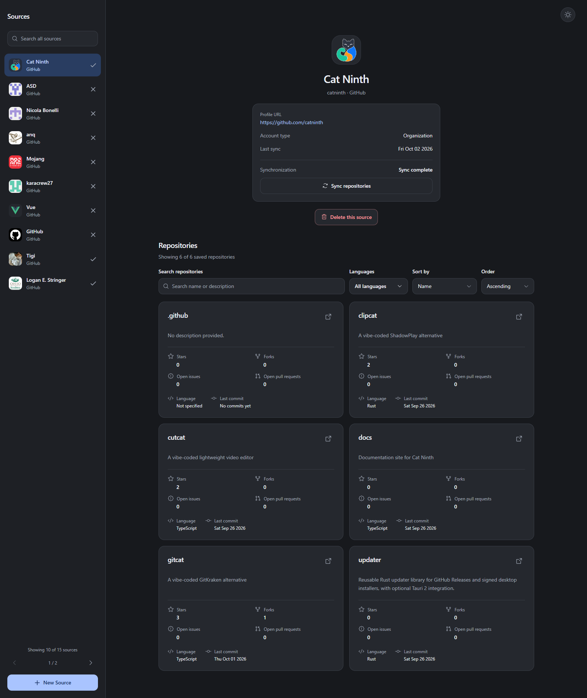

# SportMate interjúfeladat

A docs mappában minden kézzel írt a hitelesség érdekében, a NOTES.md-ben érdemes kezdeni.

⚠️⚠️ AI SLOP LENT ⚠️⚠️

A [próbafeladat](https://github.com/sportmatehu/medior-interview) megoldása: GitHub-felhasználók és szervezetek publikus repositoryjainak szinkronizálása, kereshető helyi listával.

Egy GitHub-fiók hozzáadása után az alkalmazás háttérben tölti le az adatokat. A már elmentett repositoryk közben böngészhetők, kereshetők és rendezhetők; a felület jelzi a szinkron állapotát és az esetleges hibákat. A listázás a helyi adatbázisból dolgozik, így a keresések nem indítanak új GitHub-kérést.

Az alap a Laravel hivatalos Vue starter kitje; a projekt Laravel 13, Vue 3, Inertia 3 és SQLite használatával készült.



## Elindítás

Szükséges környezet: PHP 8.4.1 vagy újabb 8.x verzió SQLite-támogatással, Composer 2 és Node.js 22.x, legalább 22.18-as verzióval. Az első szinkronhoz internetkapcsolat kell. Külön adatbázis-szervert vagy Redist az alapműködéshez nem kell telepíteni.

Friss letöltés után, a projekt könyvtárában:

```sh
composer setup
composer dev
```

A `setup` telepíti a függőségeket, előkészíti a `.env` fájlt és az SQLite-adatbázist, futtatja a migrációkat, majd elkészíti a frontend buildet. Első telepítésre szolgál: új alkalmazáskulcsot is generál. Későbbi indításokhoz elég a `composer dev`.

Az alkalmazás a **http://localhost:8000** címen érhető el. A `composer dev` a webes kiszolgáló és a frontend mellett a háttérfeladatokat feldolgozó queue listenert is elindítja. Az adatbázis kezdetben üres; az első GitHub-fiókot a felületen lehet hozzáadni.

### GitHub-token – opcionális

A `.env` fájlban megadható egy `GITHUB_PAT`. Token nélkül is működik a szinkron, de a GitHub szűkebb API-kerete miatt hamarabb várakozásra kényszerülhet, különösen sok repository esetén. Érvényes tokennel több kérés fér a keretbe. A token a szerveren marad; a jelenlegi megoldás tokennel is csak publikus repositorykat szinkronizál.

Ha futás közben változik a beállítás, a `php artisan config:clear` után a `composer dev` folyamatot is újra kell indítani.

### Redis – opcionális gyorsítás

**A kipróbáláshoz nem szükséges Redis.** A tartós adatok SQLite-ban vannak. A Redis az ismétlődő repository-keresések eredményét tárolja átmenetileg; ha nem érhető el, az alkalmazás közvetlenül az SQLite-adatbázisból állítja össze a találatokat. A keresés és a szinkron ilyenkor is működik.

Ha a megosztott cache-t is kipróbálnád, engedélyezd a PHP `redis` bővítményét, és indíts Redist, például a mellékelt Docker Compose szolgáltatással:

```sh
docker compose up -d --wait repository-cache
```

A `.env.example` már ehhez a helyi Redishez van beállítva. Ez a parancs csak a cache-t indítja; az alkalmazást továbbra is a `composer dev` futtatja.

## Mit érdemes kipróbálni?

1. **GitHub-fiók felvétele.** Adj hozzá egy létező felhasználót vagy szervezetet. A szerver ellenőrzi a fiókot, elmenti a profilját, és elindítja az első szinkront. Hibás vagy már felvett fióknál visszajelzést ad.
2. **Szinkron követése.** A repositoryk feldolgozás közben fokozatosan jelennek meg. Látszik a folyamat állapota, az utolsó sikeres szinkron és az esetleges hiba. API-korlátnál a rendszer várakozik, majd folytatja a munkát.
3. **Keresés és szűrés.** Keress a repositoryk nevében vagy leírásában, majd válassz egy vagy több programozási nyelvet. A feltételek együtt használhatók, és a teljes mentett listára érvényesek, nem csak az éppen látható oldalra. Az oldalsáv keresője az összes mentett GitHub-forrás között keres.
4. **Rendezés és lapozás.** Rendezhetsz név, nyitott issue-k, nyitott PR-ok, utolsó commit, csillagok vagy forkok szerint, mindkét irányban. A repositoryknál külön láthatók a fontosabb adatok és az archivált állapot.
5. **Újraszinkronizálás.** A Sync gombbal frissíthetők a mentett adatok. Az ismert repositoryk frissülnek, nem keletkezik belőlük új példány. Sikertelen futás után a szinkron a mentett feldolgozási ponttól folytatható.

További képek a [docs/imgs](docs/imgs/) könyvtárban találhatók.

## Főbb döntések és kompromisszumok

- **Helyi adatok, háttérben futó szinkron.** A GitHub elérése külön integrációs rétegbe került; a felületet kiszolgáló lekérdezések a mentett adatokat olvassák. A hosszabb szinkron queue-ban fut. Jelenleg a GitHub támogatott, de a provider interfész előkészíti további szolgáltatók bekötését.
- **SQLite az egyszerű indításhoz.** A projekt kipróbálásához nem kell külön adatbázis-szerver. Az adatok és a queue is itt maradnak meg. A cache érvénytelenítéséhez SQLite-triggerek is tartoznak, ezért más adatbázisra váltáskor ezeket át kell dolgozni.
- **Folytatható feldolgozás.** A szinkron oldalanként dolgozza fel a GitHub listáját, és elmenti, hol tart. Forrásonként egy aktív futás engedélyezett; az ismételt indítást és a párhuzamos írásokat külön védelem kezeli. Az átmeneti hibák korlátozott újrapróbálást kapnak, az API-korlát miatti várakozás nem fogyasztja ezt a keretet. A kéréseknek és a háttérfeladatoknak is van időkorlátjuk.
- **Pontosabb adatok, több API-hívás.** A nyitott issue-k és PR-ok külön szerepelnek, az utolsó commit dátuma pedig a default branch tényleges commitjából származik. Ezekhez további GitHub-kérések szükségesek, ezért nagyobb fióknál hosszabb szinkron és kvótavárakozás is előfordulhat.

### Azonosítók és indexek

A duplikáció elleni védelmet az adatbázis is biztosítja:

- A forrásoknál a `provider + remote_id`, illetve a `provider + normalized_account` egyedisége akadályozza meg ugyanannak a fióknak a többszöri felvételét.
- A repository elsődleges kulcsa a providerrel kiegészített külső azonosító, például `github:123`. Ez átnevezéskor is ugyanazt a repositoryt azonosítja.
- A `(git_source_id, name, external_id)` index a forráson belüli, név szerinti lapozást támogatja; az azonos nevek sorrendjét a külső azonosító teszi egyértelművé.
- A források `(created_at, id)` indexe a legújabbal kezdődő, stabil sorrendű listázást támogatja.

Ezek az indexek az egyediséget és az alaplisták lekérdezését szolgálják. A névben és leírásban végzett részszöveges kereséshez nincs külön teljes szöveges keresőindex.

## Ami jelenleg nincs benne

- Nincs időzített automatikus szinkron vagy webhook. Szinkron felvételkor és kézi indításra történik; a már elindult feladat szükség esetén automatikusan újrapróbálkozik.
- A GitHubról eltűnt vagy priváttá vált repository korábbi helyi rekordja megmarad. Ezek külön jelölése vagy törlése még nincs megoldva.
- A keresés névben és leírásban működik, a repositoryk README-tartalmát nem tölti le és nem keresi.
- Nincs felhasználónként elkülönített forráslista vagy privát repositoryk kezelése. A JSON-végpontok a webalkalmazást szolgálják ki, önálló mobilos hitelesítés nem készült.

## Ellenőrzés

A backendtesztek futtatása:

```sh
php artisan test
```

A teljes kódellenőrzés, frontend- és PHP-típusellenőrzéssel, formázásellenőrzéssel és tesztekkel:

```sh
composer ci:check
```

A tesztek többek között a forrás felvételét, a GitHub-válaszok feldolgozását, a létrehozást és frissítést, a duplikációvédelmet, a lapozást, a szinkron hibáit és a cache működését ellenőrzik. A GitHub-hívásokat tesztválaszok helyettesítik; a tesztek külön SQLite memória-adatbázist és izolált cache-t használnak, így GitHub-token és futó Redis nélkül is futtathatók.

A frontend build külön a `npm run build` paranccsal ellenőrizhető; ezt az első telepítéskor a `composer setup` is lefuttatja.

## Ráfordítás, AI-használat és folytatás

**Ráfordított idő: körülbelül 8 óra; pontos időmérés nem készült.**

A feladat technikai bontását és a megvalósítás irányát én terveztem meg. Az AI-t az implementációhoz, az ötleteim felülvizsgálatához és a hibák javításához használtam. A használt eszközök, a promptok, a módosított javaslatok és az ellenőrzések az [AI-használati dokumentációból](docs/AI_USAGE.md) és a [fejlesztési beszélgetésekből](docs/sessions/) követhetők. A beszélgetésekhez külön, saját megjegyzések is tartoznak.

Következő fejlesztési irányként GitHub App- és webhook-integrációt terveznék: megfelelő jogosultsággal privát repositoryk támogatását, valamint változáskor célzott frissítést a teljes lista ismételt lekérése helyett. Az összekapcsolást egy teljes szinkron követné, hogy az addigi változások is bekerüljenek.

Az [eredeti feladat saját megjegyzésekkel](docs/TASK.md) és a [projektjegyzetek](docs/NOTES.md) további hátteret adnak a döntésekhez.
