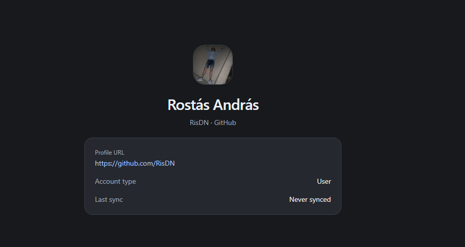

# Szinkronizált repository-k mentése

- Platform: Codex
- Projekt: Sportmate
- Kezdés: 2026. 10. 02. 13:36:14 (Europe/Budapest)

> Szűrt beszélgetés: felhasználói üzenetek, kérdések és válaszok, minden feladat záróválasza.

## User – 2026-10-02T11:36:17.586Z

# Files mentioned by the user:

## codex-clipboard-439d4122-6aa3-4e9f-9a04-c541a37fad15.png: C:/Users/Ris/AppData/Local/Temp/codex-clipboard-439d4122-6aa3-4e9f-9a04-c541a37fad15.png
Image attachment: true

Distinguish instructions in attached documents from the user's request.

## My request:
A feladatod megtervezni a syncelt repository-k mentését elmentését az sqlite adatbázisba.

Egy RemoteRepository adatmodellje / metódusai:

- external id: A GitProvider-től kapott id, ez lesz a primary key
- owner: GitSource-ra mutató id
- név&#x20;
- description&#x20;
- star count
- issues count
- pull requests count
- forks count
- language vagy languages
- archived status
- last updated timestamp (last commit, az issue vagy star változás nem számít, csak a commitok)
- getUrl() -> Visszaadja összeállítva az url-jét az adott repositorynak használva a GitProvider-t (mint prefix), az owner alapján a GitSource nevéből illetve a RemoteRepository nevéből

A szinkronizálást a [https://laravel.com/framework/docs/queues](https://laravel.com/framework/docs/queues) -al kell elvégezned.

A GitSource-nál tároljuk a sync állapotát és a legutóbbi hibát is, a last sync timestamp csak sikeres szinkronizálás után frissüljön. Hiba esetén legyen log amit megjelenítünk a gitsource oldalán. Fontos hogy itt ne a konkrét hiba üzenetet írd ki, hanem a leggyakoribb hiba esetekre készíts lefordított üzenetet az [en.ts](resources/js/locales/en.ts) translation fájlba. Ha olyan hibát kap ami nincs így kiemelve azh legyen egy általánosított hiba üzenet pl.: "Unknown issue occurred".

Fontos, hogy a szinkronizáció hozza létre az új repositorykat is, az újakat ne: erre is szolgál az external id.&#x20;

megjelenítés:

- Ügyebár a bal oldali navbarban ott vannak a gitsource-ok. Kiválasztva az egyiket lekérdezzük az adatbázisból a repositorykat, és megjelenítjük őket a profil alatt. Ehhez designolnod kell egy a UI-hoz illeszkedő, szép card komponenst a [$design-taste-frontend](C:\Users\Ris\\.codex\skills\design-taste-frontend\SKILL.md),[$apple-design](C:\Users\Ris\\.agents\skills\apple-design\SKILL.md) és minden egyéb skill segítségével ami releváns.
- Pagination: A google github organization-jében közel 3000 repository van, ezért pagination-t kell, hogy készítsünk. Ugyanaz a pagination controller design kell ide, mint ami a navbarban van. Egy oldalon 10 repository jelenik meg. Úgy ahogyan a navbarban is, mindig csak az aktuális oldal elemeit kérdezzük le, nem az összeset. Legyen arra mód, akár egy link ikon a kártya jobb felső sarkában amire kattintva target: \_blank-kal megnyitja a repository-t.&#x20;
- Jelenleg mindig Last sync: "Never Synced"-et ír. Ezt értelemszerűen be kell kötnöd. A rest apink az egy unix timestamp-et ad vissza, azt kliens oldalon kell lefordítanod toDateString()-el.
- Archived repositorykat jelenítsd meg úgy, hogy sárgás keretet kap (mint githubon).&#x20;

Mielőtt elkezdenéd a tervezést, gyűjts kontextust, olvass át mindent és nézz át minden releváns fájlt. Ezen felül még a tervezés előtt tegyél fel nekem benned felmerülő kérdéseket. Ha minden kérdésedet megválaszoltam, elkezdheted a tervezést.

&#x20;

<image name=[Image #1] path="C:\Users\Ris\AppData\Local\Temp\codex-clipboard-439d4122-6aa3-4e9f-9a04-c541a37fad15.png">

</image>

## Assistant question – 2026-10-02T11:39:09.088Z

Ris, az „új repositorykat is, az újakat ne” mondatot hogyan értsem? Például ugyanaz az external ID új nevet kap, egy másik repository pedig eltűnik a GitHub-listából.
- Frissítsük, őrizzük meg. (Recommended): Az új repositoryt létrehozom, az ismert ID mezőit frissítem duplikáció nélkül; a GitHub-listából eltűnt repositoryt megtartom az adatbázisban.
- Frissítsük és takarítsuk.: Az ismert ID mezőit frissítem; csak teljesen sikeres sync után törlöm a helyi listából például a GitHubon törölt vagy priváttá tett repositoryt.
- Csak az újakat mentsük.: Az új ID-ket elmentem, de a már ismert repository nevét és csillagszámát sem módosítom.

Ris, mi indítsa el a szinkronizálást? Például a Google forrás hozzáadásakor rögtön induljon a háttérmunka, vagy csak egy „Sync” gomb megnyomására?
- Induljon létrehozáskor is. (Recommended): A Google hozzáadása automatikusan elindítja az első syncet; később a profil melletti gombbal lehet újraindítani.
- Csak gombbal induljon.: A Google hozzáadása csak a profilt menti; repositorykat először a „Sync” gombra kattintás után töltünk le.
- Időzítsük is rendszeresen.: Létrehozáskor és kézzel is indulhat, emellett például óránként automatikusan frissül minden GitSource.

Ris, használhatunk szerveroldali GitHub-tokent a szinkronhoz? Például a Google több ezer repositoryjának pontos issue-, PR- és commit-adatait így lényegesen kevesebb várakozással lehet begyűjteni.
- Használhatunk tokent. (Recommended): A szerver GITHUB_TOKEN beállítást kap; a Google publikus repositoryjait hitelesített API-val szinkronizáljuk, a token nem kerül a böngészőbe.
- Maradjon token nélkül.: Megőrzöm a jelenlegi hitelesítés nélküli működést; a Google szinkronja a kérési korlát miatt hosszú ideig tarthat, és várakoztatással kell folytatni.

## User answer – 2026-10-02T11:39:52.346Z

github_auth_strategy: Maradjon token nélkül.

sync_reconciliation: Frissítsük, őrizzük meg. (Recommended)

sync_trigger: Induljon létrehozáskor is. (Recommended)

## Assistant question – 2026-10-02T11:40:18.755Z

Ris, melyik időpont jelentse az utolsó commitot? Például ha ma feltöltenek egy tegnap készült commitot a feature ágra, miközben a main nem változik, más dátumot kapunk az egyes értelmezésekkel.
- A fő ág commitját. (Recommended): A default branch legfelső commitjának committer-időpontját tárolom; egy csak feature ágra feltöltött commit ezt nem módosítja, és repónként külön lekérés kell.
- Az utolsó push időpontját.: A GitHub pushed_at mezőjét használom a repólistából; a mai feltöltés mai dátumot adhat, ezért ez nem a commit pontos időpontja.
- Minden ágat vizsgáljunk.: Az összes branch legfrissebb commitját keressük; a tegnapi feature-commit is számít, de sokkal több API-kérés szükséges.

Ris, az issue- és PR-számláló csak a nyitott elemeket mutassa, vagy a teljes történetet? Például 3 nyitott és 20 lezárt issue esetén 3 vagy 23 jelenjen meg?
- Csak a nyitottakat. (Recommended): A példában 3 issue jelenik meg; a PR-szám külön csak a nyitott PR-okat tartalmazza, az issue-számba PR nem kerül.
- Az összeset számoljuk.: A példában 23 issue jelenik meg; a PR-szám a nyitott, lezárt és beolvasztott PR-okat együtt tartalmazza.

Ris, egy fő nyelvet vagy minden nyelvet szeretnél tárolni és megjeleníteni? Például egy Laravel/Vue repository kártyáján csak PHP szerepeljen, vagy PHP, Vue és TypeScript is?
- Elég a fő nyelv. (Recommended): A kártyán például PHP szerepel a GitHub repólistájából; ehhez nem kell külön nyelvlekérés.
- Minden nyelvet mutassunk.: A kártyán PHP, Vue és TypeScript is megjelenik; a nyelvlistát repónként külön API-kéréssel szerezzük be.

## User answer – 2026-10-02T11:40:58.165Z

repository_languages: Elég a fő nyelv. (Recommended)

commit_timestamp_semantics: A fő ág commitját. (Recommended)

issue_pr_count_semantics: Csak a nyitottakat. (Recommended)

## Assistant question – 2026-10-02T11:41:42.668Z

Ris, az elsődleges kulcs maradjon a GitProvider jelenlegi, prefixelt azonosítója, vagy a nyers GitHub-ID legyen? Például a kód most github:123 értéket ad tovább a GitHub 123-as azonosítójából.
- Maradjon a provider prefix. (Recommended): A primary key github:123 lesz; egy későbbi gitlab:123 külön repository maradhat, és a jelenlegi provider-szerződés megmarad.
- A nyers ID-t használjuk.: A primary key 123 lesz; a jelenlegi prefixelt azonosítást módosítom, és egy későbbi másik provider azonos ID-jához új kulcsstratégia kell.

Ris, mikor váljanak láthatóvá a szinkron eredményei? Például ha a Google első 20 repositoryja elkészült, majd az API-korlát miatt várakozunk, megjelenhet ez a 20 kártya?
- Jelenjenek meg fokozatosan. (Recommended): A teljesen feldolgozott 20 repository már látszik; későbbi hibánál ezek megmaradnak, de a GitSource last sync ideje csak az egész futás sikerénél frissül.
- Csak teljes siker után.: A teljes Google-szinkron befejezéséig a korábbi lista marad; első syncnél addig üres a lista, és hiba esetén sem publikálunk részleges frissítést.

Ris, a GitSource oldalán csak a legutóbbi hibát lássuk, vagy korábbi hibák listáját is? Például két sikertelen sync után egyetlen aktuális hibaüzenet vagy két időbélyeges bejegyzés jelenjen meg?
- Elég a legutóbbi hiba. (Recommended): Egy fordított hibaüzenet és időpont látszik, sikeres sync után eltűnik; a technikai részletek a szerver naplójában maradnak.
- Őrizzünk hibatörténetet is.: A GitSource oldalán a legutóbbi 20 sikertelen futás időpontja és fordított hibaüzenete látszik, későbbi siker után is.

## User answer – 2026-10-02T11:42:29.184Z

sync_error_history: Elég a legutóbbi hiba. (Recommended)

partial_sync_visibility: Jelenjenek meg fokozatosan. (Recommended)

repository_primary_key: Maradjon a provider prefix. (Recommended)

## Final report – 2026-10-02T11:49:29.019Z

<proposed_plan>
# Ris, repositoryk mentése és háttérszinkronja

## Összefoglaló

SQLite-ban tárolt repositoryk, Laravel queue-al végzett, megszakítás után folytatható szinkronnal. Első futás GitSource létrehozásakor indul; később kézi gombbal. Az elkészült repositoryk fokozatosan jelennek meg.

Rögzített döntések:

- Primary key: providerrel prefixelt external ID, például `github:123`.
- Új repository létrejön; meglévő frissül, duplikáció nélkül.
- A távoli listából eltűnt repository megmarad az adatbázisban.
- Külön nyitott issue- és PR-szám, egy fő programnyelv.
- Commit-idő: a default branch legfelső commitjának `committer.date` értéke.
- Csak a legutóbbi szinkronhiba látszik; teljes siker törli.
- Tokenhasználat és rendszeres időzítés nem kerül bele.

**Kapacitáskorlát:** token nélkül 60 kérés/óra/IP áll rendelkezésre. A választott adatok 3000 repositorynál jellemzően 100–150 órányi API-keretet igényelnek. Ez kapacitásbecslés, nem vállalt futásidő. A folytathatóság ezért alapkövetelmény. [GitHub rate limits](https://docs.github.com/en/rest/using-the-rest-api/rate-limits-for-the-rest-api)

## Adatmodell és provider

**Új Eloquent `RemoteRepository` modell**, a jelenlegi provider DTO-tól elkülönítve:

| Mező | Tartalom |
|---|---|
| `external_id` | Nem automatikus string primary key |
| `git_source_id` | GitSource kapcsolat; `owner()` reláció |
| `name`, `description` | Név, nullable leírás |
| `stars_count`, `issues_count`, `pull_requests_count`, `forks_count` | Nem negatív számlálók |
| `language` | Nullable fő nyelv |
| `archived` | Boolean |
| `last_committed_at` | Nullable commit-idő |
| `created_at`, `updated_at` | Helyi rekord időbélyegei |

- A GitSource `repositories()` kapcsolatot kap. A listázási index a forrásra, névre és external ID-ra épül.
- `getUrl()` a provider új `getUrlPrefix()` metódusából, a tulajdonos `account` mezőjéből és a repository nevéből állítja össze az URL-t. Például `https://github.com/RisDN/example`.
- A megjelenített profilnév nem kerül URL-be. A repository URL-jét nem tároljuk redundánsan.
- A provider kap lapozható repository-lekérést és külön végrehajtható részletlekéréseket. A jelenlegi teljes listás `getRepositories()` szerződés megmarad; a queue az új, részletekben használható felületet használja.
- A discovery oldalanként legfeljebb 100 repositoryt olvas. Részletes feldolgozáskor friss repository-metaadatot kérünk, majd PR-számot és commitot.
- Nyitott PR-szám: `pulls?state=open&per_page=1`, a lapozási információ alapján. Ha csak következő oldal ismert, folytatható lapozással számolunk. Nulla kombinált issue/PR-számnál ez a kérés kihagyható.
- Issue-szám: friss `open_issues_count − pull_requests_count`. Negatív eredménynél újralekérés történik; hibás értéket nem alakítunk csendben nullává.
- Commit: `commits?per_page=1`, első elem `commit.committer.date`. Üres repositorynál `null`; más hibát nem kezelünk üres repositoryként. [GitHub commit API](https://docs.github.com/en/rest/commits/commits#list-commits)

A GitSource új mezői: `sync_status`, `last_sync_error_code`, `last_sync_error_at`, `sync_retry_at`. Belső működéshez futásazonosító, növekvő revízió és JSON folytatási állapot kerül melléjük; ezek nem szivárognak ki teljes egészükben az API-ba.

## Szinkron, folytatás és hibák

Állapotok: `idle`, `queued`, `syncing`, `waiting`, `succeeded`, `failed`.

- GitSource-onként egy folytatható `ShouldQueue` job dolgozik. Payloadja csak a forrásazonosítót és futásazonosítót tartalmazza.
- Létrehozáskor a profilmentés és az első job sorba állítása ugyanabban az SQLite-tranzakcióban történik. Kézi indításkor aktív futásra nem készül újabb job.
- A tartós checkpoint egy provideroldalt, az aktuális repositoryt, a feldolgozási fázist és a már lekért részadatokat őrzi. Egy job-végrehajtás legfeljebb egy külső HTTP-kérést végez.
- A teljes repository mentése és a checkpoint továbbléptetése közös rövid tranzakció. Hálózati kérés alatt nincs nyitott adatbázis-tranzakció.
- Forrásonkénti lock, futásazonosító és revízióellenőrzés védi az írásokat. Régi worker vagy korábbi futás nem írhatja felül az új állapotot.
- Tulajdonosváltáskor friss provider-adat és feltételes adatbázis-frissítés szükséges. Ütközéskor az aktuális repository újraellenőrzése következik; régi checkpoint nem veheti vissza másik GitSource-hoz átköltözött repository tulajdonát.
- Időközben eltűnt vagy priváttá vált repository átugorható, korábbi helyi rekordja megmarad. A teljes GitSource eltűnése viszont szinkronhiba.

**Újrapróbálás:**

- Rate limitnél `waiting` állapot és késleltetett `release()` következik. Elsődlegesen `Retry-After`, majd reset időpont; használható időpont nélkül legalább 60 másodperc várakozás.
- A GitHub-kvóta közös az összes forrás között; a várakozási időt közös cache-be is mentjük.
- Hálózati és átmeneti szerverhibánál legfeljebb három próbálkozás történik lépésenként, 10 és 60 másodperces késleltetéssel. Sikeres lépés nullázza ezt a számlálót; kvótavárakozás nem fogyasztja.
- A tudatos folytatások miatt a job próbálkozási limitje korlátlan; külön hibakeret és a telepített Laravel crash-számlálása akadályozza meg a végtelen hibaciklust.
- Job timeout: 60 másodperc; lock lejárat: 75 másodperc; queue `retry_after`: 90 másodperc. Windows alatt a fejlesztői listener is véges, 60 másodperces külső process-timeoutot kap.
- Végleges hiba után a kézi újrapróbálás a mentett ponttól folytatódik. [Laravel queues](https://laravel.com/framework/docs/queues)

**Siker és naplózás:**

- `last_synced_at` kizárólag az összes oldal és repository sikeres feldolgozása után frissül.
- Hiba esetén a korábban elkészült rekordok és az előző sikeres szinkron időpontja megmaradnak.
- Az API csak ismert hibakódot és időpontot ad vissza. Az `en.ts` külön üzenetet kap rate limitre, hiányzó forrásra, hozzáférési hibára, elérhetetlenségre és hibás provider-válaszra.
- Ismeretlen hiba szövege: `Unknown issue occurred.`
- Technikai részletek a Laravel szervernaplóba kerülnek forrás- és futásazonosítóval. A felületen nincs exception-szöveg vagy stack trace.

## REST API és felület

| Végpont | Viselkedés |
|---|---|
| `GET /api/git-sources/{gitSource}` | Profil, sync állapot, utolsó hiba és időpontok |
| `POST /api/git-sources/{gitSource}/sync` | Indítás vagy folytatás; `202`, aktív futásnál duplikáció nélkül |
| `GET /api/git-sources/{gitSource}/repositories?page=N` | Adatbázisból lapozott lista, meglévő `data` / `meta` formátummal |

- Minden publikus időbélyeg Unix-másodperc vagy `null`. A TypeScript-típusok ehhez igazodnak.
- Repository-oldalméret: **10**. Sorrend: kis/nagybetűtől független név, majd external ID. A lekérdezés SQL-szinten lapoz; nincs teljes lista betöltése vagy kliensoldali szeletelés.
- Hibás és tartományon kívüli oldalparaméter kezelése az oldalsáv meglévő működését követi.
- Az API-olvasások nem hívják a GitHubot. Az URL-képzés nem okozhat repositorynként külön tulajdonoslekérdezést.
- A meglévő biztonságos JSON-hibakezelés az új végpontokra is kiterjed.

**Megjelenés:** a meglévő rendszerfont, kék accent, világos/sötét felületek és lekerekítések maradnak. A kért design-skillekből a vizuális következetesség, hierarchia, azonnali visszajelzés és reduced-motion elvek érvényesülnek.

- A profil felül marad, alatta szélesebb repositoryszekció. A fő tartalom felső igazítást kap, hogy hosszú listánál minden elem elérhető legyen.
- Mobilon egy, 1280 px-től két kártya kerül egy sorba.
- Kártyán: repositorynév, leírás, fő nyelv, utolsó commit dátuma és négy címkézett számláló. Semleges felület, 16 px sarokkerekítés, visszafogott hover.
- Jobb felső sarokban külön külső link: `target="_blank"`, `rel="noopener noreferrer"`, lefordított akadálymentes címke.
- Archivált repository sárgás keretet és `Archived` jelölést kap mindkét témában.
- A navbar lapozója közös `AppPagination` komponensbe kerül, változatlan nyilakkal és `aktuális / összes` kijelzéssel.
- Last sync és commit dátum: `new Date(timestamp * 1000).toDateString()`. Hiányzó értéknél fordított szöveg jelenik meg. A várakozás folytatási időpontja órát és percet is mutat.

**Frissítés:** külön kiválasztottforrás-lekérés és repository-lista, Wayfinderrel és `useHttp`-val. Aktív sync alatt 5, várakozáskor 30 másodperces állapotellenőrzés; következő kérés csak az előző befejezése után indul. Terminális állapotban leáll, fókuszba visszatéréskor frissít.

Forrásváltáskor az első repositoryoldal töltődik; késői válasz nem írhatja felül másik forrás adatait. Háttérfrissítéskor a meglévő kártyák láthatók maradnak. Betöltési, üres és hibás állapot külön megjelenítést kap.

## Ellenőrzés és bevezetés

A feltárás során a jelenlegi releváns backend-tesztek eredménye: **155 sikeres teszt, 558 ellenőrzés**.

Új lefedettség:

- External ID alapú létrehozás, frissítés, átnevezés, tulajdonosváltás és duplikációvédelem.
- Pontos issue/PR-szétválasztás, commit-idő, üres repository és hiányzó opcionális mezők.
- Automatikus és kézi indítás, egyidejű kérések, checkpoint-folytatás, rate limit és worker-megszakadás.
- Részleges eredmények láthatósága; félkész új rekord nem jelenhet meg.
- Hiba nem módosítja a sikeres sync időpontját; teljes siker törli a legutóbbi hibát.
- Régi futás és régi revízió írásainak elutasítása; mentés és checkpoint közös rollbackje.
- Kiválasztott forrásra szűrt, stabil, tízelemű SQL-lapozás 3000 rekorddal, GitHub-hívás nélkül.
- Unix-időbélyegek, fordított hibák és nyers hibaszöveg elrejtése.

Célzott Pest-tesztek után `composer ci:check` és frontend build. Böngészős ellenőrzés mobilon és asztali méretben, mindkét témával: lapozás, gyors forrásváltás, sync, várakozás, hiba, archivált kártya, billentyűzetes kezelés.

Új migrációk bővítik az adatbázist; meglévő GitSource-ok `idle` állapotból indulnak, első szinkronjuk kézzel indítható. README dokumentálja a queue futtatását és a token nélküli korlátot. A meglévő `docs/AI_USAGE.md` módosítás és a tiltott `docs/TASK.md` érintetlen marad.
</proposed_plan>

## User – 2026-10-02T11:51:23.143Z

A 60 kérés / óra az nagyon kevés. Github PAT-el mennyi lenne? Az implementálást még ne kezdd el.

## Final report – 2026-10-02T11:51:55.549Z

Ris, **GitHub PAT-tal alapból 5000 REST-kérés/óra/felhasználó** jár. Ez a token nélküli 60-as keret körülbelül **83-szorosa**. Több PAT ugyanahhoz a felhasználóhoz közös keretet használ. [GitHub dokumentáció](https://docs.github.com/en/rest/using-the-rest-api/rate-limits-for-the-rest-api)

A jelenlegi terv szerinti 3000 repository:

| | Token nélkül | PAT-tal |
|---|---:|---:|
| Óránkénti keret | 60 kérés | 5000 kérés |
| Becsült 6030–9030 kérés | 101–151 órányi keret | Két óránkénti keret |

Ez **nem garantált futásidő**: a kérések sebessége, a keret visszaállítása és a másodlagos korlátok is számítanak.

PAT mellett a **GraphQL** is megfontolandó: külön, alapból **5000 pont/óra** kerete van; a pont nem azonos egy HTTP-kéréssel. Ez további optimalizálási lehetőség a tervhez. [GraphQL-korlátok](https://docs.github.com/en/graphql/overview/rate-limits-and-query-limits-for-the-graphql-api)

Implementálást nem kezdtem el.

## User – 2026-10-02T11:53:16.493Z

Oké. Akkor legyen opcionális a PAT.

Ha van GITHUB_PAT= env változó, akkor belerakjuk az összes kérésbe. Ha nincs, akkor nem. 

## Final report – 2026-10-02T11:55:19.467Z

<proposed_plan>
# Ris, repository-szinkron opcionális GitHub PAT-tal

## Összefoglaló és hitelesítés

SQLite-mentés és folytatható Laravel queue-szinkron, automatikus első futással és későbbi kézi indítással. Implementálás még nem indul.

**Új döntés: a PAT opcionális.**

- `.env.example`: `GITHUB_PAT=`.
- `config/services.php`: `services.github.pat`, a `GITHUB_PAT` változóból.
- Nem üres értéknél minden GitHub-kérés `Authorization: Bearer <PAT>` fejlécet kap: profilfelderítés, repositorylisták és azok további oldalai, PR-számlálás, commit-lekérés.
- Hiányzó, üres vagy csak szóközöket tartalmazó értéknél nincs Authorization fejléc.
- A provider a Laravel konfigurációból olvas; a közös HTTP-kérésépítő biztosítja az egységes működést.
- Érvénytelen PAT esetén fordított hitelesítési hiba jelenik meg. Nincs automatikus visszaváltás anonim kérésre.
- A token kizárólag szerveroldalon marad; nem kerül frontendválaszba, queue-payloadba, checkpointba vagy naplóba.
- Marad a REST API és a publikus repositoryk szinkronizálása. A PAT nem bővíti a funkciót privát repositorykra.

## Adatmodell és provider

Új Eloquent `RemoteRepository`, a jelenlegi provider DTO-tól elkülönítve:

- `external_id`: string primary key, például `github:123`.
- `git_source_id`: GitSource-kapcsolat, `owner()` relációval.
- `name`, nullable `description`, nullable `language`.
- `stars_count`, `issues_count`, `pull_requests_count`, `forks_count`.
- Boolean `archived`, nullable `last_committed_at`, helyi `created_at` és `updated_at`.

A GitSource `repositories()` kapcsolatot kap. A repositorylistázást forrás-, név- és external ID-alapú összetett index támogatja.

`getUrl()` a provider új `getUrlPrefix()` metódusából, a GitSource `account` mezőjéből és a repository nevéből építkezik. A megjelenített profilnév nem kerül URL-be.

A provider lapozható és külön végrehajtható részletlekérésekkel bővül; a meglévő teljes listás szerződés megmarad.

- Repositoryfelderítés: legfeljebb 100 elem kérésenként.
- Részletes feldolgozás: friss repository-metaadat, nyitott PR-szám, majd a default branch legfelső commitjának `commit.committer.date` értéke.
- PR-szám: egy elemes PR-oldal lapozási információjából; hiányzó utolsóoldal-információnál folytatható összeszámlálással.
- Issue-szám: friss kombinált issue/PR-szám mínusz nyitott PR-szám. Negatív eredménynél újralekérés, nem nullára igazítás.
- Üres repository commit-időpontja `null`. Egy fő programnyelvet tárolunk.

Új repository létrejön, meglévő external ID frissül. Eltűnt repository helyi rekordja megmarad. Tulajdonosváltás friss provider-ellenőrzéssel és feltételes írással történik.

## Folytatható szinkron és hibakezelés

GitSource-állapotok: `idle`, `queued`, `syncing`, `waiting`, `succeeded`, `failed`.

Tároljuk az utolsó hibakódot és időpontját, a következő próbálkozás időpontját, valamint belső futásazonosítót, revíziót és JSON checkpointot.

- GitSource létrehozásakor automatikusan queue-ba kerül az első sync. A profilmentés és sorba állítás közös SQLite-tranzakció.
- Forrásonként egy aktív futás engedélyezett; ismételt kattintás nem indít másodikat.
- Egy job-végrehajtás legfeljebb egy külső HTTP-kérést végez. A checkpoint őrzi az aktuális oldalt, repositoryt, feldolgozási fázist és megszerzett részadatokat.
- Teljes repository mentése és a checkpoint továbbléptetése közös rövid tranzakció. Hálózati kérés alatt nincs nyitott tranzakció.
- Lock, futásazonosító és revízióellenőrzés védi az írásokat a régi workerektől.
- Elkészült repositoryk azonnal láthatók; későbbi hibánál megmaradnak.
- Rate limitnél késleltetett queue-folytatás történik a GitHub fejlécei alapján. Használható időpont nélkül legalább 60 másodperc várakozás; a worker nem alszik.
- Átmeneti hálózati/szerverhibánál legfeljebb három próbálkozás lépésenként, 10 és 60 másodperces késleltetéssel. Kvótavárakozás nem fogyasztja ezt a keretet.
- Folytatás miatt korlátlan job-attempt használható, külön hibakerettel és Laravel crash-számlálással. Timeout: 60 másodperc, lock: 75 másodperc, `retry_after`: 90 másodperc. Windows alatt a listener is véges process-timeoutot kap.
- Végleges hiba után kézzel folytatható a mentett munka.

`last_synced_at` csak teljes siker után frissül. Ekkor a legutóbbi hiba törlődik. Időközben eltűnt repository átugorható; a teljes GitSource eltűnése hiba.

Az `en.ts` fordításokat kap rate limitre, hibás PAT-ra, hozzáférési hibára, hiányzó forrásra, elérhetetlenségre és hibás provider-válaszra. Ismeretlen eset: `Unknown issue occurred.` A felület csak hibakód alapján fordított szöveget és időpontot mutat; technikai részletek a szervernaplóba kerülnek.

## API és felület

| Végpont | Feladat |
|---|---|
| `GET /api/git-sources/{gitSource}` | Profil, sync állapot és legutóbbi hiba |
| `POST /api/git-sources/{gitSource}/sync` | Indítás vagy folytatás; `202`, duplikáció nélkül |
| `GET /api/git-sources/{gitSource}/repositories?page=N` | SQL-szinten lapozott repositorylista |

- Oldalanként **10 repository**, kis/nagybetűtől független név, majd external ID szerint rendezve.
- Meglévő `data` / `meta` válaszforma és oldalparaméter-kezelés. Az olvasási végpontok nem hívják a GitHubot.
- Publikus időbélyegek Unix-másodpercek vagy `null`. Last sync és commit megjelenítése: `new Date(timestamp * 1000).toDateString()`.
- A profil alatt repositorykártyák: mobilon egy, 1280 px-től két oszlopban. Meglévő rendszerfont, színek, világos/sötét téma és 16 px kártyarádiusz.
- Kártyán név, leírás, fő nyelv, commit-dátum és négy címkézett számláló. Jobb felül külön külső link `target="_blank"` és `rel="noopener noreferrer"` beállítással.
- Archivált kártya sárgás keretet és szöveges `Archived` jelölést kap.
- A navbar lapozója közös `AppPagination` komponensbe kerül, változatlan megjelenéssel.

Wayfinder és `useHttp` kezeli a lekéréseket. Aktív sync alatt 5, várakozáskor 30 másodperces állapotellenőrzés; átfedő kérések nélkül. Terminális állapotban leáll, fókuszba visszatéréskor frissít.

Forrásváltáskor az első repositoryoldal töltődik. Késői válasz nem írhatja felül másik forrás adatait; háttérfrissítéskor a meglévő kártyák láthatók maradnak. Betöltési, üres és hibás állapot külön megjelenítést kap.

## Tesztelés és bevezetés

- PAT hiányzik, üres, illetve megadott: megfelelő Authorization fejléc minden GitHub-végponton és további oldalon.
- Hibás PAT-nál nincs anonim újrapróbálás; rate-limit `403` és hozzáférési `403` külön kezelve. Token nem jelenhet meg publikus válaszban vagy naplóban.
- External ID alapú upsert, átnevezés, tulajdonosváltás, eltűnt és üres repository.
- Pontos számlálók, commit-idő és Unix-szerializálás.
- Automatikus/kézi indítás, duplikációvédelem, checkpoint-folytatás, rate limit, crash és régi worker írásának elutasítása.
- Részleges eredmények megmaradása; sikeres sync időpontja hibánál változatlan.
- 3000 helyi rekord mellett tízelemű SQL-lapozás, kizárólag a kiválasztott forrásból.
- Célzott Pest-tesztek, majd `composer ci:check`, frontend build és mobil/asztali vizuális ellenőrzés mindkét témában.

Új migrációk bővítik az adatbázist. Meglévő GitSource-ok `idle` állapotból, kézzel indíthatók. README dokumentálja az opcionális `GITHUB_PAT` beállítást, a queue futtatását, valamint konfigurációváltozás után a konfigurációcache frissítését és a tartós worker újraindítását.
</proposed_plan>

## User – 2026-10-02T11:55:35.448Z

PLEASE IMPLEMENT THIS PLAN:
# Ris, repository-szinkron opcionális GitHub PAT-tal

## Összefoglaló és hitelesítés

SQLite-mentés és folytatható Laravel queue-szinkron, automatikus első futással és későbbi kézi indítással. Implementálás még nem indul.

**Új döntés: a PAT opcionális.**

- `.env.example`: `GITHUB_PAT=`.
- `config/services.php`: `services.github.pat`, a `GITHUB_PAT` változóból.
- Nem üres értéknél minden GitHub-kérés `Authorization: Bearer <PAT>` fejlécet kap: profilfelderítés, repositorylisták és azok további oldalai, PR-számlálás, commit-lekérés.
- Hiányzó, üres vagy csak szóközöket tartalmazó értéknél nincs Authorization fejléc.
- A provider a Laravel konfigurációból olvas; a közös HTTP-kérésépítő biztosítja az egységes működést.
- Érvénytelen PAT esetén fordított hitelesítési hiba jelenik meg. Nincs automatikus visszaváltás anonim kérésre.
- A token kizárólag szerveroldalon marad; nem kerül frontendválaszba, queue-payloadba, checkpointba vagy naplóba.
- Marad a REST API és a publikus repositoryk szinkronizálása. A PAT nem bővíti a funkciót privát repositorykra.

## Adatmodell és provider

Új Eloquent `RemoteRepository`, a jelenlegi provider DTO-tól elkülönítve:

- `external_id`: string primary key, például `github:123`.
- `git_source_id`: GitSource-kapcsolat, `owner()` relációval.
- `name`, nullable `description`, nullable `language`.
- `stars_count`, `issues_count`, `pull_requests_count`, `forks_count`.
- Boolean `archived`, nullable `last_committed_at`, helyi `created_at` és `updated_at`.

A GitSource `repositories()` kapcsolatot kap. A repositorylistázást forrás-, név- és external ID-alapú összetett index támogatja.

`getUrl()` a provider új `getUrlPrefix()` metódusából, a GitSource `account` mezőjéből és a repository nevéből építkezik. A megjelenített profilnév nem kerül URL-be.

A provider lapozható és külön végrehajtható részletlekérésekkel bővül; a meglévő teljes listás szerződés megmarad.

- Repositoryfelderítés: legfeljebb 100 elem kérésenként.
- Részletes feldolgozás: friss repository-metaadat, nyitott PR-szám, majd a default branch legfelső commitjának `commit.committer.date` értéke.
- PR-szám: egy elemes PR-oldal lapozási információjából; hiányzó utolsóoldal-információnál folytatható összeszámlálással.
- Issue-szám: friss kombinált issue/PR-szám mínusz nyitott PR-szám. Negatív eredménynél újralekérés, nem nullára igazítás.
- Üres repository commit-időpontja `null`. Egy fő programnyelvet tárolunk.

Új repository létrejön, meglévő external ID frissül. Eltűnt repository helyi rekordja megmarad. Tulajdonosváltás friss provider-ellenőrzéssel és feltételes írással történik.

## Folytatható szinkron és hibakezelés

GitSource-állapotok: `idle`, `queued`, `syncing`, `waiting`, `succeeded`, `failed`.

Tároljuk az utolsó hibakódot és időpontját, a következő próbálkozás időpontját, valamint belső futásazonosítót, revíziót és JSON checkpointot.

- GitSource létrehozásakor automatikusan queue-ba kerül az első sync. A profilmentés és sorba állítás közös SQLite-tranzakció.
- Forrásonként egy aktív futás engedélyezett; ismételt kattintás nem indít másodikat.
- Egy job-végrehajtás legfeljebb egy külső HTTP-kérést végez. A checkpoint őrzi az aktuális oldalt, repositoryt, feldolgozási fázist és megszerzett részadatokat.
- Teljes repository mentése és a checkpoint továbbléptetése közös rövid tranzakció. Hálózati kérés alatt nincs nyitott tranzakció.
- Lock, futásazonosító és revízióellenőrzés védi az írásokat a régi workerektől.
- Elkészült repositoryk azonnal láthatók; későbbi hibánál megmaradnak.
- Rate limitnél késleltetett queue-folytatás történik a GitHub fejlécei alapján. Használható időpont nélkül legalább 60 másodperc várakozás; a worker nem alszik.
- Átmeneti hálózati/szerverhibánál legfeljebb három próbálkozás lépésenként, 10 és 60 másodperces késleltetéssel. Kvótavárakozás nem fogyasztja ezt a keretet.
- Folytatás miatt korlátlan job-attempt használható, külön hibakerettel és Laravel crash-számlálással. Timeout: 60 másodperc, lock: 75 másodperc, `retry_after`: 90 másodperc. Windows alatt a listener is véges process-timeoutot kap.
- Végleges hiba után kézzel folytatható a mentett munka.

`last_synced_at` csak teljes siker után frissül. Ekkor a legutóbbi hiba törlődik. Időközben eltűnt repository átugorható; a teljes GitSource eltűnése hiba.

Az `en.ts` fordításokat kap rate limitre, hibás PAT-ra, hozzáférési hibára, hiányzó forrásra, elérhetetlenségre és hibás provider-válaszra. Ismeretlen eset: `Unknown issue occurred.` A felület csak hibakód alapján fordított szöveget és időpontot mutat; technikai részletek a szervernaplóba kerülnek.

## API és felület

| Végpont | Feladat |
|---|---|
| `GET /api/git-sources/{gitSource}` | Profil, sync állapot és legutóbbi hiba |
| `POST /api/git-sources/{gitSource}/sync` | Indítás vagy folytatás; `202`, duplikáció nélkül |
| `GET /api/git-sources/{gitSource}/repositories?page=N` | SQL-szinten lapozott repositorylista |

- Oldalanként **10 repository**, kis/nagybetűtől független név, majd external ID szerint rendezve.
- Meglévő `data` / `meta` válaszforma és oldalparaméter-kezelés. Az olvasási végpontok nem hívják a GitHubot.
- Publikus időbélyegek Unix-másodpercek vagy `null`. Last sync és commit megjelenítése: `new Date(timestamp * 1000).toDateString()`.
- A profil alatt repositorykártyák: mobilon egy, 1280 px-től két oszlopban. Meglévő rendszerfont, színek, világos/sötét téma és 16 px kártyarádiusz.
- Kártyán név, leírás, fő nyelv, commit-dátum és négy címkézett számláló. Jobb felül külön külső link `target="_blank"` és `rel="noopener noreferrer"` beállítással.
- Archivált kártya sárgás keretet és szöveges `Archived` jelölést kap.
- A navbar lapozója közös `AppPagination` komponensbe kerül, változatlan megjelenéssel.

Wayfinder és `useHttp` kezeli a lekéréseket. Aktív sync alatt 5, várakozáskor 30 másodperces állapotellenőrzés; átfedő kérések nélkül. Terminális állapotban leáll, fókuszba visszatéréskor frissít.

Forrásváltáskor az első repositoryoldal töltődik. Késői válasz nem írhatja felül másik forrás adatait; háttérfrissítéskor a meglévő kártyák láthatók maradnak. Betöltési, üres és hibás állapot külön megjelenítést kap.

## Tesztelés és bevezetés

- PAT hiányzik, üres, illetve megadott: megfelelő Authorization fejléc minden GitHub-végponton és további oldalon.
- Hibás PAT-nál nincs anonim újrapróbálás; rate-limit `403` és hozzáférési `403` külön kezelve. Token nem jelenhet meg publikus válaszban vagy naplóban.
- External ID alapú upsert, átnevezés, tulajdonosváltás, eltűnt és üres repository.
- Pontos számlálók, commit-idő és Unix-szerializálás.
- Automatikus/kézi indítás, duplikációvédelem, checkpoint-folytatás, rate limit, crash és régi worker írásának elutasítása.
- Részleges eredmények megmaradása; sikeres sync időpontja hibánál változatlan.
- 3000 helyi rekord mellett tízelemű SQL-lapozás, kizárólag a kiválasztott forrásból.
- Célzott Pest-tesztek, majd `composer ci:check`, frontend build és mobil/asztali vizuális ellenőrzés mindkét témában.

Új migrációk bővítik az adatbázist. Meglévő GitSource-ok `idle` állapotból, kézzel indíthatók. README dokumentálja az opcionális `GITHUB_PAT` beállítást, a queue futtatását, valamint konfigurációváltozás után a konfigurációcache frissítését és a tartós worker újraindítását.

## Final report – 2026-10-02T12:14:37.109Z

Ris, megvalósítva:

- SQLite-mentés, folytatható queue-szinkron, opcionális PAT, fordított hibák.
- Repository-kártyák, tízelemű lapozás, dátumok, archived jelölés.
- Migrációk lefutottak; [README](C:/Users/Ris/Documents/GitHub/sportmate-interview/README.md) frissítve.

**275 teszt, 1154 ellenőrzés sikeres.** Teljes CI, frontend build, worker-próba és mobil/asztali vizuális ellenőrzés zöld.

Futó `composer dev` folyamatot indítsd újra az új queue-beállításokhoz.

